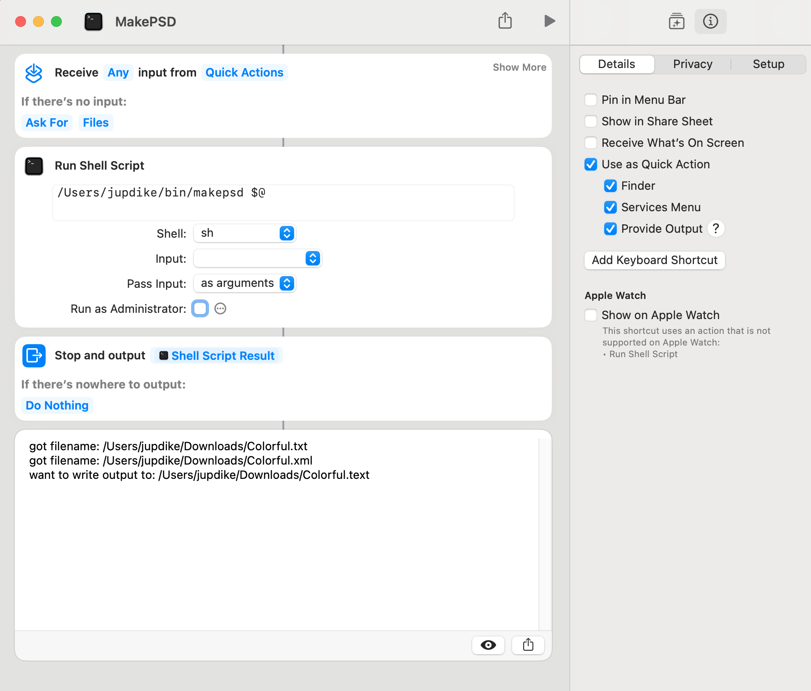

# Make PSD

## A simple Swift / Objective-C command-line utility for macOS Sonoma Shortcuts

Make a shell script shortcut Quick Action and then multi-select some files in Finder, then right click and Make PSD to combine multiple images into a single PSD file in one step.

Here is the example Shortcut:

Note: you might need to allow Full-Disk access to Finder? :shrug emoji:
